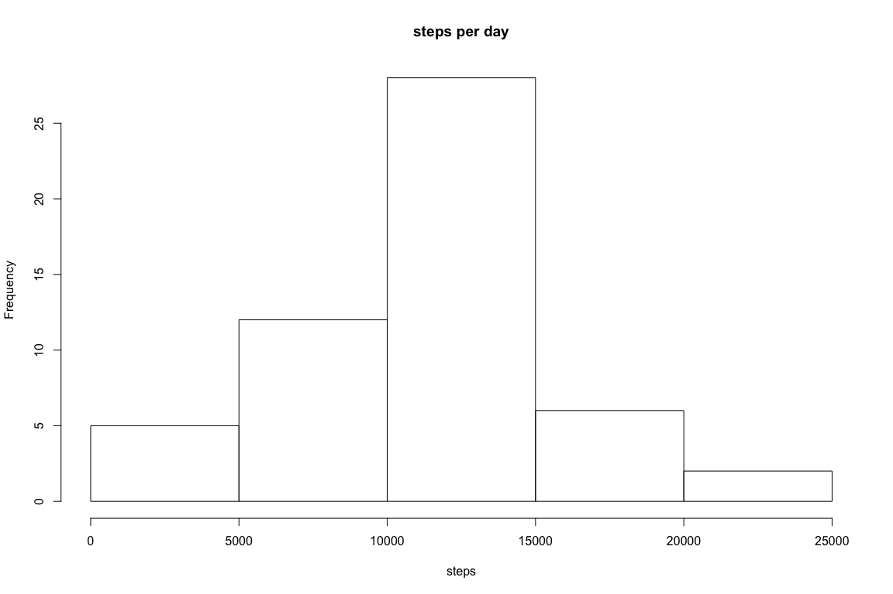
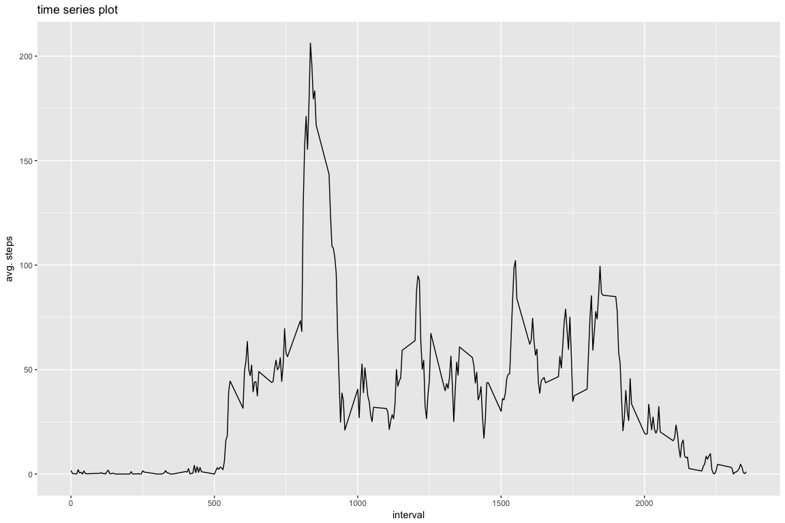
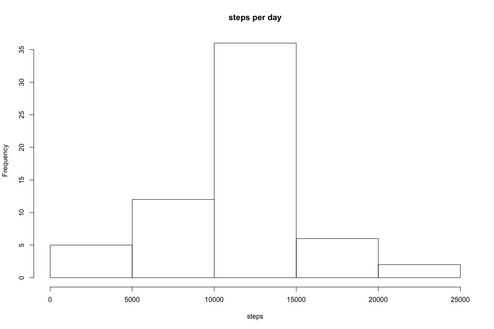
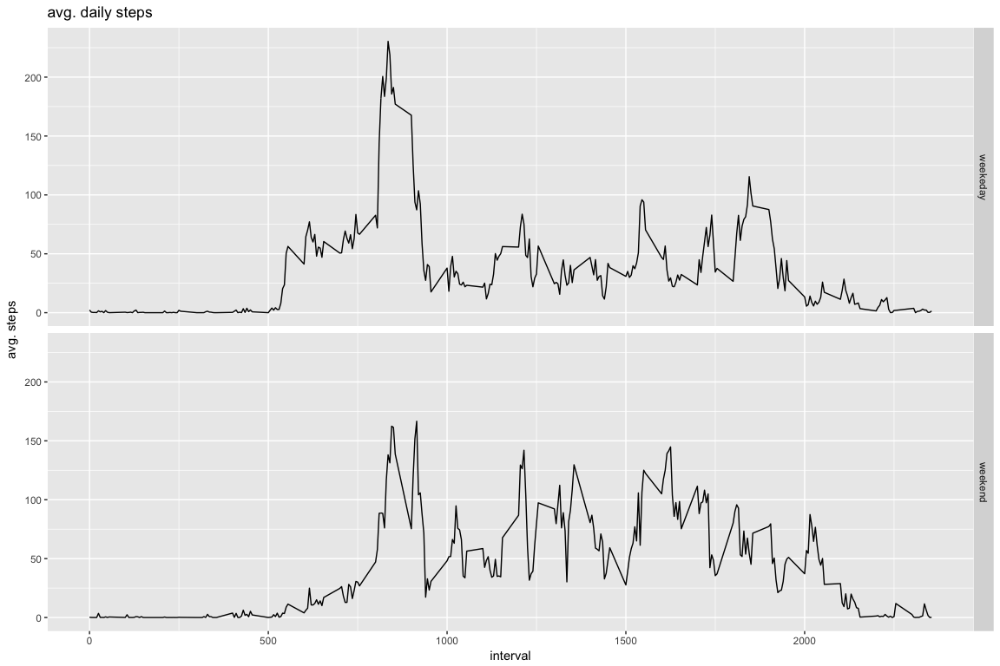

# Global settings


```r
library(knitr)

opts_chunk$set(fig.width=12, fig.height=8, fig.path='Figs/', echo=TRUE, eval= TRUE)
```


## Loading and preprocessing the data


```r
#Set WD and load data
setwd("~/Coursera")

if (!file.exists("~/Coursera/activity.csv")) {
  unzip(zipfile = "~/Coursera/activity.zip")
}

activity <- read.csv(file="activity.csv")
```


## What is mean total number of steps taken per day?


```r
# Calculate the total number of steps taken per day
agg_steps <- aggregate(steps ~ date, activity, FUN=sum)

# Calculate and report the mean and median of the total number of steps taken per day
mean_steps <- mean(agg_steps$steps, na.rm = TRUE)
median_steps <- median(agg_steps$steps, na.rm = TRUE)

# Generate histogram
hist(agg_steps$steps, main = "steps per day", xlab = "steps")
```

<!-- -->

The mean of the total steps taken is 1.0766189\times 10^{4} ane the median is 10765.


## What is the average daily activity pattern?


```r
# Make a time series plot
# of the 5-minute interval (x-axis) and the average number of 
# steps taken, averaged across all days (y-axis)

library(ggplot2)

mean_agg_steps <- aggregate(steps ~ interval, activity, mean)

ggplot(data = mean_agg_steps, aes(x = interval, y = steps)) + geom_line() + ggtitle("time series plot") + 
        xlab("interval") + ylab("avg. steps")
```

<!-- -->


```r
# Which 5-minute interval, on average across all the days in 
#the dataset, contains the maximum number of steps?

max_interval <- mean_agg_steps[which.max(mean_agg_steps $steps),2]
```


## Imputing missing values


```r
# Calculate and report the total number of missing values in the dataset 

missing <- is.na(activity$steps)

# Create a new dataset that is equal to the original dataset
# but with the missing data filled in

complete_activity <- transform(activity, steps = ifelse(is.na(activity$steps), mean_agg_steps$steps[match(activity$interval, mean_agg_steps$interval)], activity$steps))

# Make a histogram of the total number of steps taken each day and
# and report the mean and median.

complete_agg_steps <- aggregate(steps ~ date, complete_activity, FUN=sum)

hist(complete_agg_steps$steps, main = "steps per day", xlab = "steps")
```

<!-- -->


```r
# Calculate and report the mean and median total number of steps taken per day. 

complete_mean_steps <- mean(complete_agg_steps$steps, na.rm = TRUE)
complete_median_steps <- median(complete_agg_steps$steps, na.rm = TRUE)
mean_diff = complete_mean_steps - mean_steps
median_diff = complete_median_steps - median_steps
net_diff = sum(complete_agg_steps$steps) - sum(agg_steps$steps)
```

Results of differnces between the two datasets:  
- (Mean: 0)  
- (Median: 1.1886792)  
- (Total 8.6129509\times 10^{4})


## Are there differences in activity patterns between weekdays and weekends?


```r
# Create a new factor variable in the dataset with two levels – “weekday” and “weekend” 
# indicating whether a given date is a weekday or weekend day.

day_type <- function(date) {day <- weekdays(date)
  if (day %in% c('Monday', 'Tuesday', 'Wednesday', 'Thursday', 'Friday'))
      return ("weekeday")
  else if (day %in% c('Saturday', 'Sunday'))
      return ("weekend")
  else
      stop ("Error")
}

complete_activity$date <- as.Date(complete_activity$date)
complete_activity$day <- sapply(complete_activity$date, FUN = day_type)

# Make a panel plot containnig a time-series plot of the 5-minute interval
# and the average number of steps taken across all weekdays or weekends

avg_steps_per_day <- aggregate(steps ~ interval + day, complete_activity, mean)

ggplot(data = avg_steps_per_day, aes(x = interval, y = steps)) + geom_line() + facet_grid(day ~ .) + ggtitle("avg. daily steps") + xlab("interval") + ylab("avg. steps")
```

<!-- -->


